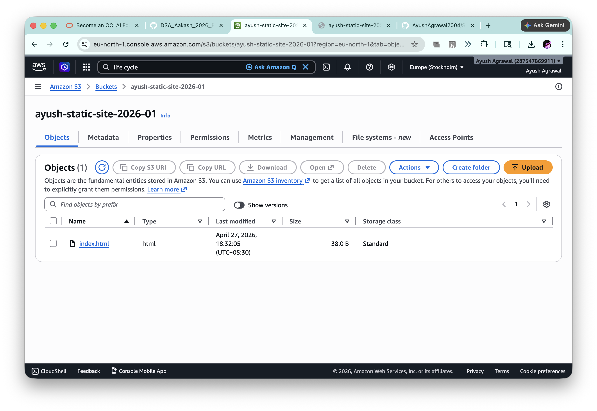
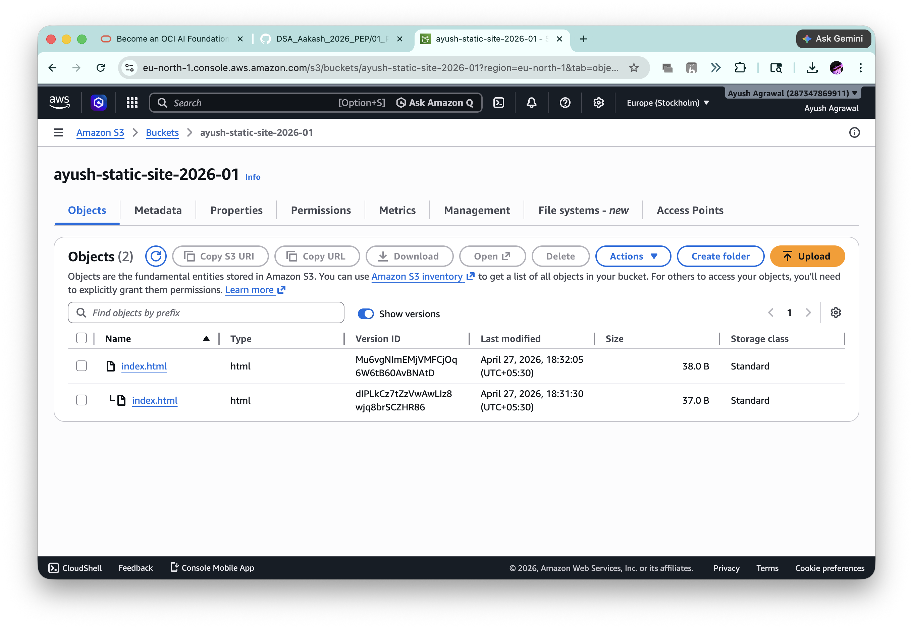
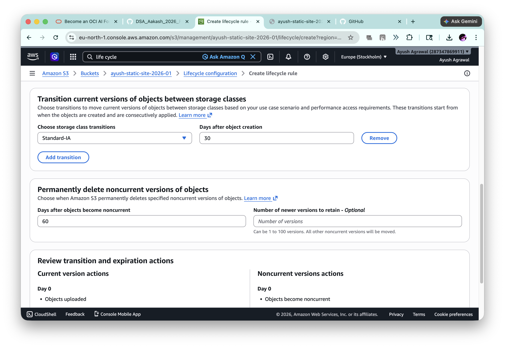

# 🚀 AWS S3 Static Website Hosting with Versioning & Lifecycle Rules

## 👨‍💻 Student Details

- **Name:** Ayush Agrawal  
- **Registration Number:** 12322587
- **Course:** B.Tech CSE  
- **Assignment:** AWS S3 Static Website Hosting  
- **Platform:** Cipher Schools  

---

# 🌐 Deployed Website Link

👉 http://ayush-static-site-2026-01.s3-website.eu-north-1.amazonaws.com/

---

# 📌 Project Overview

This project demonstrates how to create an AWS S3 bucket, enable versioning, host a static website, and configure lifecycle rules for storage optimization.

---

# 🪣 Step 1: S3 Bucket Creation

- Created a new S3 bucket  
- Bucket name kept globally unique  
- Uploaded website files successfully  

### 📸 Screenshot: Bucket with Uploaded Files Visible

---

# 🔄 Step 2: Versioning Enabled

- Enabled bucket versioning  
- Uploaded `index.html`
- Modified file and uploaded again  
- Multiple versions created successfully  

### 📸 Screenshot: Versioning View

---

# 🌐 Step 3: Static Website Hosting

- Enabled static website hosting  
- Used `index.html` as index document  
- Website deployed successfully  

---

# ♻️ Step 4: Lifecycle Rule Configuration

Created lifecycle rules for automation and cost savings:

- Transition objects to **Standard-IA** after 30 days  
- Delete previous versions after 60 days  

### 📸 Screenshot: Lifecycle Rule

---

# ⚠️ Challenges Faced

- Bucket name already existed, needed globally unique name  
- Public access blocked initially  
- Bucket policy errors while enabling website access  
- Understanding versioning for same file uploads  
- Lifecycle settings confusion at first  

---

# ✅ Solutions Implemented

- Used unique bucket name  
- Disabled block public access carefully  
- Added correct bucket policy  
- Re-uploaded same file after modification  
- Configured lifecycle rules successfully  

---

# 🎯 Learning Outcomes

- AWS S3 bucket management  
- Static website hosting without EC2  
- Object versioning in S3  
- Lifecycle automation for cost optimization  
- Public bucket permission handling  

---

# 📸 Important Note

👉 In all screenshots, AWS username is clearly visible as required.

---

# 📅 Submission Status

- **Assignment Status:** ✅ Completed  
- **Student Name:** Ayush Agrawal  

---
